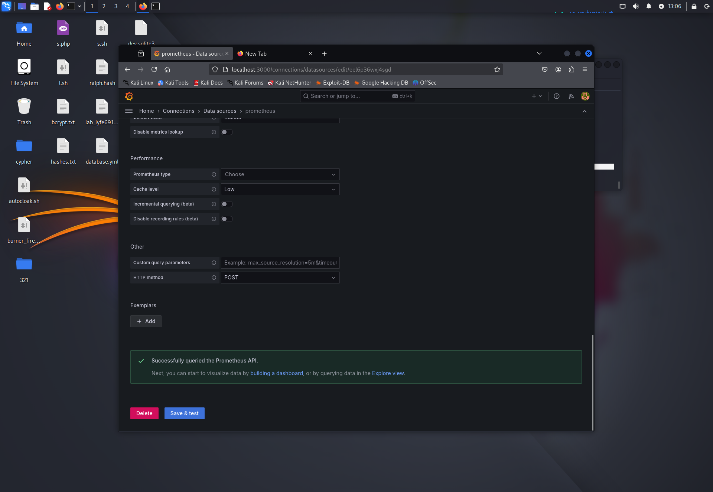
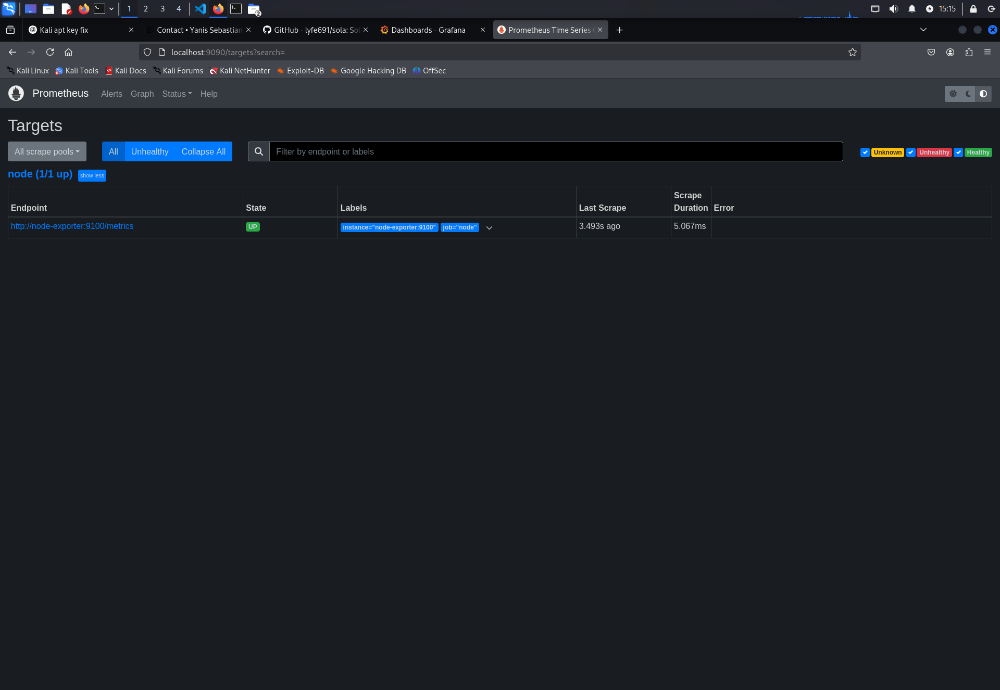
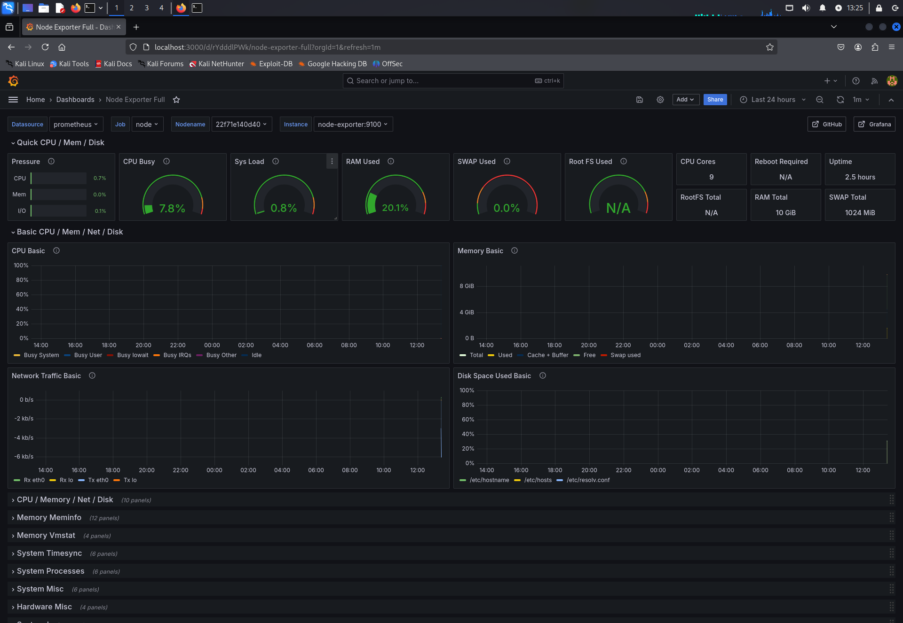
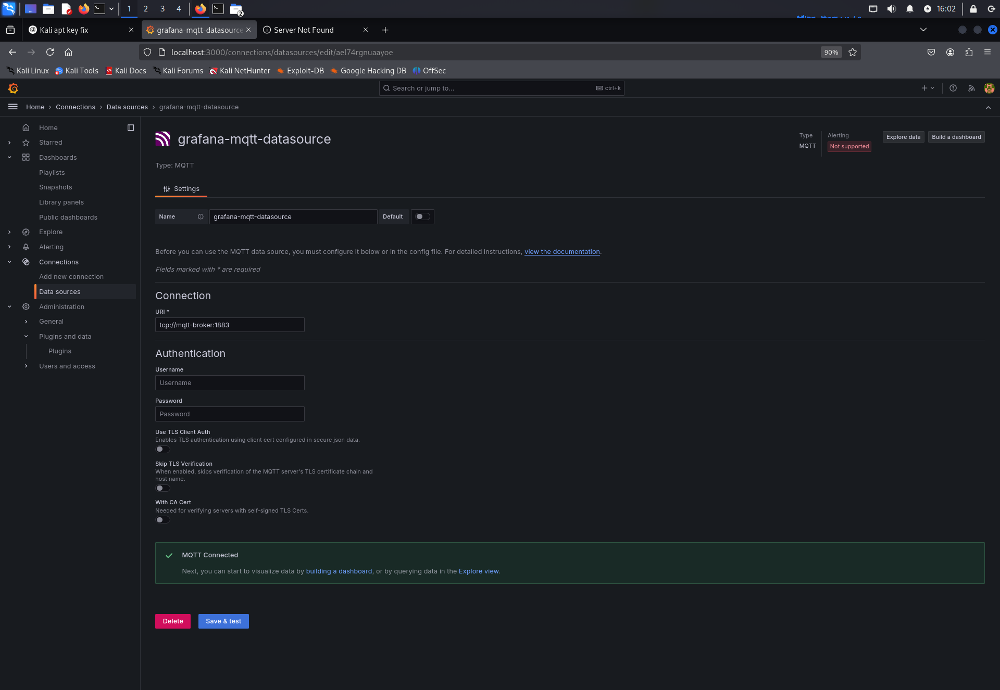
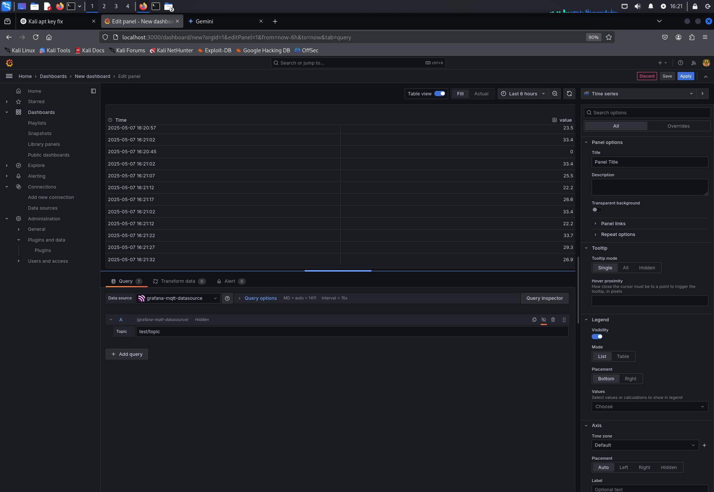

# SideQuest: Grafana & Prometheus Monitoring Demo

**Team:**

* Yanis Sebastian Zürcher - Doku & Umsetzung
* Jason Bichsel - Recherche & Testing
* Dominik Könitzer - Recherche

**Datum:** 11.05.2025
**Deadline:** Vor dem Start des nächsten Unterrichtsblocks (14.05.2025)

---

## 1. Zielsetzung

1. Ein vollständiges Monitoring Setup aufsetzen mit **Prometheus**, **Node Exporter** und **Grafana** für Host Metriken.
2. Eine **MQTT-Integration** in Grafana demonstrieren: Broker aufsetzen, Plugin installieren, Live-Sensor-Daten visualisieren.

---

## 2. Verwendete Technologie

* **Docker Engine**
* **Docker Compose**
* **Prometheus**
* **Node Exporter**
* **Grafana OSS**
* **Kali Linux (Host) + Docker-Container**

---

## 3. Verzeichnisstruktur

```text
~/sq-grafana/
├── docker-compose.yml
├── prometheus.yml
├── mosquitto.conf
├── s.sh
└── doc.md         
```

---

## 4. Setup & Deployment

1. **verzeichnis anlegen**

   ```bash
   mkdir ~/sq-grafana && cd ~/sq-grafana
   ```
2. **`docker-compose.yml` erstellen**

   ```yml
   version: "3.8"

   services:
   prometheus:
      image: prom/prometheus:v2.52.0
      container_name: prometheus
      volumes:
         - ./prometheus.yml:/etc/prometheus/prometheus.yml:ro
      ports:
         - "9090:9090"
      restart: unless-stopped

   node-exporter:
      image: prom/node-exporter:v1.8.0
      container_name: node-exporter
      ports:
         - "9100:9100"
      restart: unless-stopped

   mqtt-broker:
      image: eclipse-mosquitto:2.0.21
      container_name: mqtt-broker
      ports: 
         - "1883:1883"  
      volumes:
         - ./mosquitto.conf:/mosquitto/config/mosquitto.conf:ro
      restart: unless-stopped

   grafana:
      image: grafana/grafana-oss:11.0.0
      container_name: grafana
      environment:
         GF_SECURITY_ADMIN_USER: admin
         GF_SECURITY_ADMIN_PASSWORD: admin
      ports:
         - "3000:3000"
      depends_on:
         - prometheus
         - mqtt-broker
      restart: unless-stopped


   ```
3. **`prometheus.yml`**

   ```yml
    global:
    scrape_interval: 15s
    evaluation_interval: 15s

    scrape_configs:
    - job_name: 'node'
        static_configs:
        - targets:
            - 'node-exporter:9100'
   ```
4. **`mosquitto.conf` **

```config
listener 1883
allow_anonymous true
```

5. **`s.sh`**

random 20.0–34.9°C Werte alle 5 Sek. als JSON { "value": xx.x }

```bash
   #!/bin/bash

   while true; do
   val=$(awk -v r=$RANDOM 'BEGIN{printf "%.1f", (r % 150)/10 + 20}')
   mosquitto_pub -h localhost -t test/topic -m "{\"value\":$val}"
   echo "Published value=$val"
   sleep 5
   done

```

6. **Stack starten**

```bash
docker-compose pull
docker-compose up -d
docker-compose ps
```

---

## 5. Grafana-Konfiguration

1. **Login**

   * URL: `http://localhost:3000`
   * login: **username: admin / password: admin** (die daten die ich im docker-compose angelegt habe.)
   * pwd ändern
2. **Datenquelle hinzufügen**

   * Menü **Connections -> Data sources -> Add new data source**
   * Typ: **Prometheus**
   * URL: `http://prometheus:9090`
   * **Save & Test**
   * **Ergebnis:** grüner Banner "Successfully queried the Prometheus API"
     
3. **Dashboard importieren**

   * Menü **Dashboard -> new -> import**
   * Feld "Grafana.com dashboard URL or ID": `1860` → **Load**
   * Data Source: **prometheus** auswählen -> **Import**

---

## 6. Verifikation des Monitorings

* **Prometheus Targets**: unter `http://localhost:9090/targets` zeigt node als UP.
  
* **Grafana-Dashboard**:

  * CPU-Auslastung, RAM-Verbrauch, etc...

    

---

6. MQTT → Grafana

   MQTT-Plugin:
   Falls noch nötig, in der grafana-shell (oder via GF_INSTALL_PLUGINS):

   sudo grafana-cli plugins install briangann-grafana-mqtt-datasource
   sudo systemctl restart grafana-server

   Datenquelle:

   ⚙️ Configuration → Add data source → MQTT

   Name: MQTT-Broker

   Broker URL: tcp://mqtt-broker:1883

  


   Panel erstellen:

   ➕ Create → Dashboard → Add new panel

   Data source: MQTT-Broker

   Topic: test/topic

   Value field: value

   Visualization: Time series, Time range: Last 5 minutes → Apply

   Screenshot:

   

7. Issues & Lösungen

   Mosquitto-Service scheiterte auf dem Host:
   → haben stattdessen den Eclipse-Mosquitto-Container verwendet.

   Port-Konflikte (1883) & Namenskonflikte:
   → alte Container gelöscht, Ports nur für MQTT in Compose gemappt.

   Leere MQTT-Panels:
   → “Value field” auf value gesetzt und Table-View ausgeschaltet.

   Integer-Division im Bash-Loop:
   → durch AWK ersetzt, um Gleitkomma-Zahlen zu bekommen.

---

**Ende der Dokumentation**
