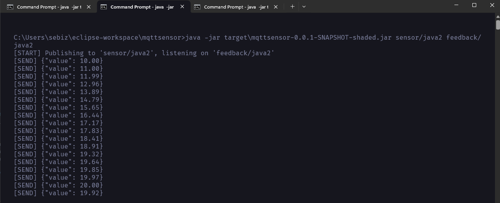

# SideQuest: 3B Java MQTT Sensor Erweiterung

**Team:**

* Yanis Sebastian Zürcher - Doku & Umsetzung
* Jason Bichsel - Recherche & Testing
* Dominik Könitzer - Recherche

**Datum:** 20.05.2025

**Deadline:** Vor dem Start des nächsten Unterrichtsblocks (21.05.2025)

---

## 1. Zielsetzung

Ziel dieser Erweiterung war es, den bestehenden Java-MQTT-Sensor so anzupassen, dass:

1. Die PUB- und SUB-Topics per Kommandozeilenparameter oder Umgebungsvariablen übergeben werden können.
2. Mehrere Sensoren mit unterschiedlichen Topics gleichzeitig gestartet werden können.
3. Die Messdaten in Grafana visuell dargestellt werden.


---

## 2. Verwendete Technologie

* **Java (OpenJDK 23)**
* **Eclipse IDE + Maven**
* **Eclipse Paho MQTT Client v1.2.5**
* **Docker (für Grafana & Mosquitto-Broker)**
* **Grafana MQTT Plugin**
* **Kali Linux VM (Bridged Modus)**

---

## 3. Setup & Deployment

#### 3.1 VirtualBox Netzwerk-Konfiguration
Da die Java-Sensoren von Windows laufen und der MQTT-Broker in der Linux VM, habe ich den Netzwerkmodus der VM auf Bridged Adapter umgestellt.
Dies war notwendig, damit Windows die IP der VM (`192.168.1.28`) erreichen kann.

> eth0


### 3.2 Java Sensor Code
Der Sensor der vorherigen aufgabe wurde so erweitert, dass er:

- PUB- und SUB-Topics per Argument oder Umgebungsvariable entgegennehmen kann
- JSON Daten im Format {`"value": <zahl>`} auf den jeweiligen Topic publiziert
- Auf "stop"-Nachrichten im SUB-Topic reagiert und sich beendet

**Cmd Beispiel**:
```cmd
java -jar mqttsensor-0.0.1-SNAPSHOT-shaded.jar sensor/java1 feedback/java1
```

**Vollständiger Code (MySensor.java)**: 
```java
package mqttsensor;

import java.util.UUID;
import org.eclipse.paho.client.mqttv3.*;

/**
 * Java MQTT Sensor (Erweitert)
 * m321 3b
 * @author Yanis Sebastian Zürcher
 */
public class MySensor {

    public static IMqttClient publisher;
    public static IMqttClient subscriber;
    public static String publisherId = UUID.randomUUID().toString();
    public static String subscriberId = UUID.randomUUID().toString();
    public static boolean active = true;

    public static void main(String[] args) {

        // Read PUB and SUB topics
        String pubTopic = args.length > 0 ? args[0] : System.getenv("PUB_TOPIC");
        String subTopic = args.length > 1 ? args[1] : System.getenv("SUB_TOPIC");

        if (pubTopic == null || subTopic == null) {
            System.err.println("PUB and SUB topics must be provided via args or environment variables");
            System.exit(1);
        }

        double x = 0;

        try {
        	// ip a
        	publisher = new MqttClient("tcp://192.168.1.28:1883", publisherId);
        	subscriber = new MqttClient("tcp://192.168.1.28:1883", subscriberId);

            subscriber.connect();

            subscriber.subscribe(subTopic, (topic, message) -> {
                System.out.println("[RECV] " + topic + ": " + message);
                if ("stop".equalsIgnoreCase(message.toString().trim())) {
                    System.out.println("[INFO] Stopping sensor due to stop message.");
                    active = false;
                }
            });

            MqttConnectOptions options = new MqttConnectOptions();
            options.setAutomaticReconnect(true);
            options.setCleanSession(true);
            options.setConnectionTimeout(10);
            publisher.connect(options);

            System.out.printf("[START] Publishing to '%s', listening on '%s'%n", pubTopic, subTopic);

            while (active) {
                double y = 10 * Math.sin(x) + 10;
                x += 0.1;
                x = x % (20 * Math.PI);

                String payload = String.format("{\"value\": %.2f}", y);
                MqttMessage msg = new MqttMessage(payload.getBytes());
                msg.setQos(0);
                msg.setRetained(true);
                publisher.publish(pubTopic, msg);

                System.out.println("[SEND] " + payload);
                Thread.sleep(1000);
            }
        } catch (Exception ex) {
            ex.printStackTrace();
        } finally {
            try { subscriber.disconnect(); } catch (Exception e) {}
            try { if (publisher.isConnected()) publisher.disconnect(); } catch (Exception e) {}
            System.out.println("[END] Sensor shutdown");
            System.exit(0);
        }
    }
}

```
### 3.3 Drei Sensoren gleichzeitig starten
Wir haben drei Terminals geöffnet und je einen Sensor mit verschiedenen Topics gestartet:

```cmd
java -jar mqttsensor-0.0.1-SNAPSHOT-shaded.jar sensor/java1 feedback/java1
java -jar mqttsensor-0.0.1-SNAPSHOT-shaded.jar sensor/java2 feedback/java2
java -jar mqttsensor-0.0.1-SNAPSHOT-shaded.jar sensor/java3 feedback/java3
```
**Terminals**: 

> java1


> java2



> java3


### 3.4 Grafana Konfiguration

Da die MQTT-Datenquelle bereits in sq 2C erstellt wurde, konnten wir direkt im Dashboard neue Queries hinzufügen:

1. Panel geöffnet -> "Edit"

2. Drei Queries hinzugefügt:

    - sensor/java1
    - sensor/java2
    - sensor/java3

3. Visualisierung auf **Time Series** eingestellt

4. Zeit: Last 5 minutes

5. Apply gedrückt


---

## 4. Ergebnis
Das Dashboard zeigt erfolgreich alle drei Sensorverläufe als Live Daten an. Jeder Sensor publiziert im Sekundentakt einen neuen Wert.


## 5. Issues & Lösungen

* **Verbindung zur VM (Java -> Broker) schlug fehl**:
  - Issue: Connection timed out beim Verbindungsaufbau aus dem Java Client
  - Lösung: VM-Netzwerk auf Bridged Adapter umgestellt, IP `192.168.1.28` verwendet

* **Java .jar konnte nicht ausgeführt werden**:
  - Issue: Fehler: `org.eclipse.paho.client.mqttv3.IMqttClient` nicht gefunden
  - Lösung: Dependency `org.eclipse.paho.client.mqttv3` eingebunden und per Shade Plugin verpackt

* **Nur ein Sensor sichtbar in Grafana**:
  - Issue: Nur eine Linie sichtbar, obwohl mehrere Sensoren erwartet wurden
  - Lösung: Drei Terminals geöffnet, unterschiedliche Topics gesetzt (java1, java2, java3)

---

**Ende der Dokumentation**