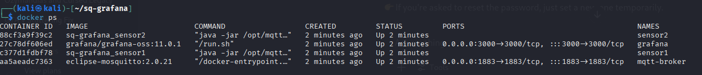

# SideQuest: 6A – Verteiltes System mit Docker & MQTT

**Team:**

* Yanis Sebastian Zürcher - Doku & Umsetzung
* Jason Bichsel - Recherche & Testing
* Dominik Könitzer - Recherche

**Datum:** 27.05.2025

**Deadline:** Vor dem Start des nächsten Unterrichtsblocks (28.05.2025)

---

## Inhaltsverzeichnis

- [1. Zielsetzung](#1-zielsetzung)
- [2. Architektur & Technologien](#2-architektur-technologien)
- [3. Docker-Compose-Stack](#3-docker-compose-stack)
- [4. Schritt 1 – Sensor-Daten anzeigen](#4-schritt-1-sensor-daten-anzeigen)
- [5. Schritt 2 – Containerstatus überwachen](#5-schritt-2-containerstatus-überwachen)
- [6. Schritt 3 – Testplan & Ergebnisse](#6-schritt-3-testplan-ergebnisse)
- [7. Schritt 4 – Stack-Aktualisierung](#7-schritt-4-stack-aktualisierung)
- [8. Reflexion & Abgabe](#8-reflexion-abgabe)

---

## 1. Zielsetzung
Auf Basis der Vorarbeit aus SQ5C soll ein vollständig containerisiertes System erstellt werden, das

- mindestens zwei Sensoren betreibt,
- einen MQTT-Broker (Mosquitto) und eine Visualisierung (Grafana) nutzt,
- komplett via Docker Compose orchestriert wird,
- überwacht und nach Testplan geprüft wird.


---

## 2. Architektur & Technologien

| Komponente      | Technologie                        | Zweck                             |
| --------------- | ---------------------------------- | --------------------------------- |
| **mqtt-broker** | Eclipse Mosquitto (v2.0.21)        | Vermittelt Nachrichten per MQTT   |
| **sensor1/2**   | Java + Eclipse Paho (im Container) | Publizieren periodisch JSON-Daten |
| **grafana**     | Grafana OSS (v11.0.1)              | Darstellung der Sensordaten       |


---

## 3. Docker-Compose-Stack

```yaml
version: "3.8"

services:
  mqtt-broker:
    image: eclipse-mosquitto:2.0.21
    container_name: mqtt-broker
    ports:
      - "1883:1883"
    volumes:
      - ./mosquitto.conf:/mosquitto/config/mosquitto.conf:ro
    restart: unless-stopped

  sensor1:
    build: ./sensor
    container_name: sensor1
    environment:
      - SENSOR_ID=java1
    depends_on: [mqtt-broker]
    restart: unless-stopped

  sensor2:
    build: ./sensor
    container_name: sensor2
    environment:
      - SENSOR_ID=java2
    depends_on: [mqtt-broker]
    restart: unless-stopped

  grafana:
    image: grafana/grafana-oss:11.0.1
    container_name: grafana
    environment:
      GF_SECURITY_ADMIN_USER: admin
      GF_SECURITY_ADMIN_PASSWORD: admin
    ports:
      - "3000:3000"
    depends_on: [mqtt-broker]
    restart: unless-stopped

```

**Starten des Stacks**:
```bash
docker compose up -d --build
```
---

## 4. Schritt 1 – Sensor-Daten anzeigen

Nach dem Start des Systems publizieren beide Sensor-Container periodisch Messwerte an sensor/java1 und sensor/java2.

Die MQTT-Datenquelle wurde in Grafana eingebunden.
Zwei Panels zeigen die Live-Datenverläufe als Time Series an.

Screenshot einfügen hier:
→ grafana_sq6a_2025-05-27.png

---

## 5. Schritt 2 – Status der Container (docker ps)



```bash

```

---


---


**Ende der Dokumentation**