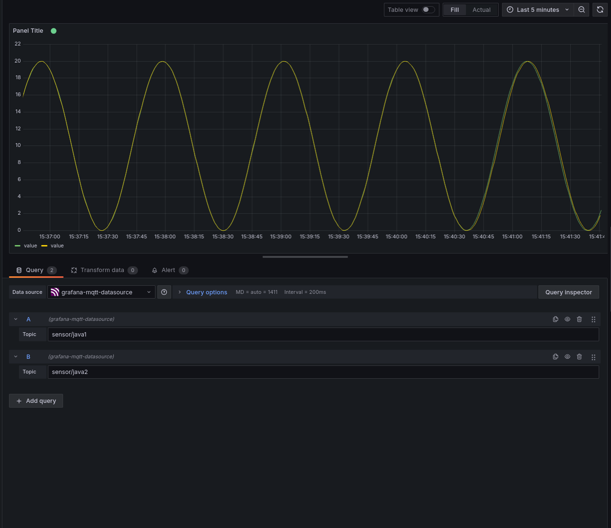
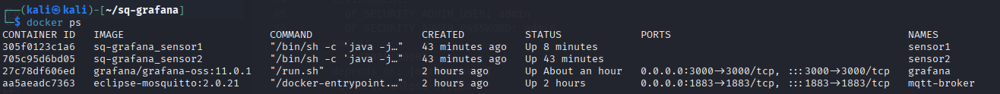

# SideQuest: 6A – Verteiltes System mit Docker & MQTT

**Team:**

* Yanis Sebastian Zürcher - Doku & Umsetzung
* Jason Bichsel - Recherche & Testing
* Dominik Könitzer - Recherche

**Datum:** 27.05.2025

**Deadline:** Vor dem Start des nächsten Unterrichtsblocks (28.05.2025)

---

## Inhaltsverzeichnis

- 1. Zielsetzung
- 2. Architektur & Technologien
- 3. Docker-Compose-Stack
- 4. Schritt 1 - Sensor-Daten anzeigen
- 5. Schritt 2 - Containerstatus überwachen
- 6. Schritt 3 - Testplan & Ergebnisse
- 7. Schritt 4 - Stack-Aktualisierung
- 8. Reflexion & Abgabe

---

## 1. Zielsetzung
Auf Basis der Vorarbeit aus SQ5C soll ein vollständig containerisiertes System erstellt werden, das:

- mindestens zwei Sensoren betreibt,
- einen MQTT-Broker (Mosquitto) und eine Visualisierung (Grafana) nutzt,
- komplett via Docker Compose orchestriert wird,
- überwacht und nach Testplan geprüft wird.


---

## 2. Architektur & Technologien

| Komponente      | Technologie                        | Zweck                             |
| --------------- | ---------------------------------- | --------------------------------- |
| **mqtt-broker** | Eclipse Mosquitto (v2.0.21)        | Vermittelt Nachrichten per MQTT   |
| **sensor1/2**   | Java + Eclipse Paho (im Container) | Publizieren periodisch JSON-Daten |
| **grafana**     | Grafana OSS (v11.0.1)              | Darstellung der Sensordaten       |

> [!NOTE]
> Ich verwendete das Java Programm das ich für die sq3b erstellt habe, dah es die anforderungen erfüllt. Ich musste das .jar file einfach von windows auf linux übertragen mit scp: 

```bash
scp C:\Users\sebiz\eclipse-workspace\mqttsensor\target\mqttsensor-0.0.1-SNAPSHOT-shaded.jar kali@192.168.1.28:~/sq-grafana/sensor/mqttsensor.jar
```

### 2.1 Projektstruktur

```bash
sq-grafana/
├── docker-compose.yml
├── mosquitto.conf                  
└── sensor/
    ├── mqttsensor.jar           
    └── Dockerfile              
```


---

## 3. Docker-Compose-Stack

### docker-compose.yml

```yaml
version: "3.8"

services:
  mqtt-broker:
    image: eclipse-mosquitto:2.0.21
    container_name: mqtt-broker
    ports:
      - "1883:1883"
    volumes:
      - ./mosquitto.conf:/mosquitto/config/mosquitto.conf:ro
    restart: unless-stopped

  sensor1:
    build: ./sensor
    container_name: sensor1
    environment:
      - SENSOR_ID=java1
    depends_on: [mqtt-broker]
    restart: unless-stopped

  sensor2:
    build: ./sensor
    container_name: sensor2
    environment:
      - SENSOR_ID=java2
    depends_on: [mqtt-broker]
    restart: unless-stopped

  grafana:
    image: grafana/grafana-oss:11.0.1
    container_name: grafana
    environment:
      GF_SECURITY_ADMIN_USER: admin
      GF_SECURITY_ADMIN_PASSWORD: admin
    ports:
      - "3000:3000"
    depends_on: [mqtt-broker]
    restart: unless-stopped

```

### Dockerfile für die Sensor-Container:

```dockerfile
# sensor/Dockerfile
FROM eclipse-temurin:17-jre
COPY mqttsensor.jar /opt/mqttsensor.jar
ENV SENSOR_ID=default
ENTRYPOINT ["/bin/sh", "-c", "java -jar /opt/mqttsensor.jar sensor/$SENSOR_ID feedback/$SENSOR_ID"]
```

**Starten des Stacks**:
```bash
docker compose up -d --build
```
---

## 4. Schritt 1 – Sensor-Daten anzeigen

Nach dem Start des Systems publizieren beide Sensor-Container periodisch Messwerte an sensor/java1 und sensor/java2.

Die MQTT-Datenquelle wurde in Grafana eingebunden.
Zwei Queries (sensor/java1, sensor/java2) zeigen die Live-Datenverläufe als Time Series an.

> Obwohl beide Sensoren identische Daten publizieren (Sinusfunktion), erscheinen sie als zwei separate Quellen und erfüllen damit die Aufgabenstellung. Wenn man genau hinschaut sieht man beide Datenquellen / Linien. (grün / gelb) 



---

## 5. Schritt 2 – Status der Container (docker ps)



```bash
┌──(kali㉿kali)-[~/sq-grafana]
└─$ docker ps                      
CONTAINER ID   IMAGE                        COMMAND                  CREATED          STATUS          PORTS                                       NAMES
305f0123c1a6   sq-grafana_sensor1           "/bin/sh -c 'java -j…"   2 minutes ago    Up 2 minutes                                                sensor1
705c95d6bd05   sq-grafana_sensor2           "/bin/sh -c 'java -j…"   2 minutes ago    Up 2 minutes                                                sensor2
27c78df606ed   grafana/grafana-oss:11.0.1   "/run.sh"                49 minutes ago   Up 29 minutes   0.0.0.0:3000->3000/tcp, :::3000->3000/tcp   grafana
aa5aeadc7363   eclipse-mosquitto:2.0.21     "/docker-entrypoint.…"   49 minutes ago   Up 49 minutes   0.0.0.0:1883->1883/tcp, :::1883->1883/tcp   mqtt-broker

```

---

## 6. Schritt 3 – Testplan & Ergebnisse

| Test-ID | Beschreibung                                                    | Erwartung                                                                   | Ergebnis |
| ------- | --------------------------------------------------------------- | --------------------------------------------------------------------------- | -------- |
| T1      | `docker compose up -d --build` ausführen                                | Alle Container starten erfolgreich und bleiben aktiv                        | ✅        |
| T2      | `docker ps` prüfen                                              | Alle Container sichtbar und "Up"                                           | ✅        |
| T3      | MQTT-Topics `sensor/java1` & `sensor/java2` in Grafana abfragen | Time Series zeigen periodische Werte an                                     | ✅        |
| T4      | Werte grafisch in Grafana sichtbar                              | Zwei getrennte Linien (z.B. grün/gelb), live aktualisiert                   | ✅        |
| T5      | `mosquitto_pub -t feedback/java1 -m stop` senden                | `sensor1` erkennt Stoppbefehl, beendet sich selbst                          | ✅        |
| T6      | `docker logs sensor1` prüfen                                    | Log enthält `[RECV] feedback/java1` & `[INFO] Stopping sensor...`           | ✅        |
| T7      | Nur `sensor1` gestoppt, `sensor2` sendet weiter                 | `sensor2` publiziert weiterhin Daten an seinen Topic                        | ✅        |
| T8      | Netzwerkausfall simulieren (MQTT down)                          | Sensor erkennt Verbindungsfehler, reconnectet automatisch                   | ✅        |
| T9      | `docker compose pull grafana` ausführen                         | Neue Grafana-Version wird geladen, startet korrekt                          | ✅        |
| T10     | Fehlerhafte ENV Variable (`SENSOR_ID=...`)                      | Container startet mit korrekt expandierten Topics, nicht als `${SENSOR_ID}` | ✅        |

---

## 7. Schritt 4 – Stack-Aktualisierung

Im Rahmen der Aufgabe wurde die Grafana-Version auf 11.0.1 aktualisiert:

```bash
docker compose pull grafana
docker compose up -d
```

Zusätzlich wurde das Dockerfile für die Sensor-Container korrigiert, um die Umgebungsvariable SENSOR_ID korrekt per Shell zu expandieren:

```bash
ENTRYPOINT ["/bin/sh", "-c", "java -jar /opt/mqttsensor.jar sensor/$SENSOR_ID feedback/$SENSOR_ID"]
```
Damit wurde sichergestellt, dass jeder Sensor seinen eigenen Topic nutzt.


---

## 8. Reflexion

Die Umsetzung dieser Aufgabe war sehr praxisnah und hat mir geholfen, viele zentrale Konzepte rund um verteilte Systeme zu verinnerlichen:

- Wir konnten unser Wissen über Docker und Containerisierung vertiefen, insbesondere im Umgang mit Java Anwendungen, Umgebungsvariablen und Build-Kontexten.
- Die Herausforderung mit dem ENTRYPOINT und der ENV-Expansion (`$SENSOR_ID`) war nervig, aber ein wichtiges Learning: JSON basierte ENTRYPOINTs interpretieren Variablen nicht, Shell basierte schon.
- Die Teamarbeit war effizient: Ich habe die technische Umsetzung und Dokumentation übernommen, während meine Teampartner recherchiert und getestet haben.

Rückblickend war es hilfreich, bereits vorhandene Komponenten (Sensor aus SQ3B) wiederzuverwenden, statt das gnze neu zu erfinden. Das spart Zeit und fokussiert die Energie auf das Wichtige: Integration und Funktion.


---

**Ende der Dokumentation**