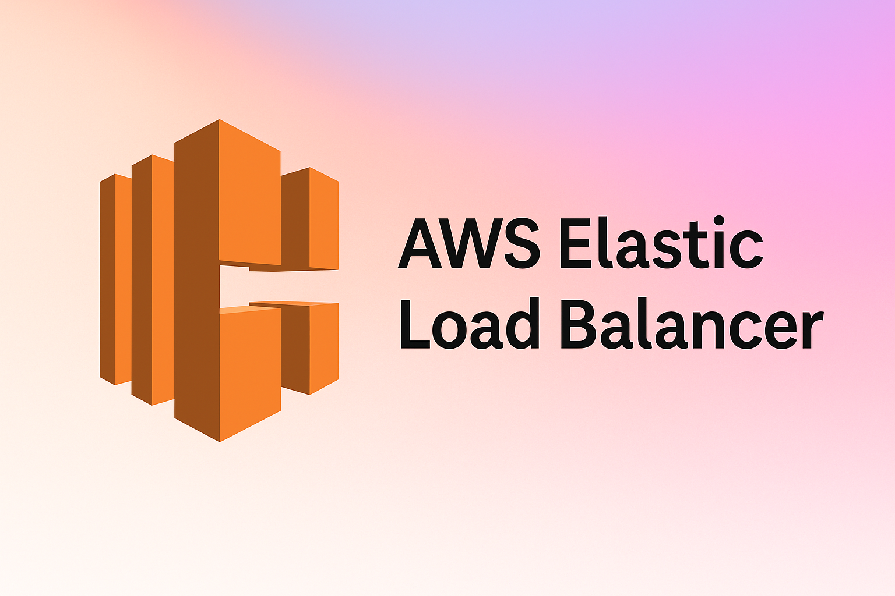
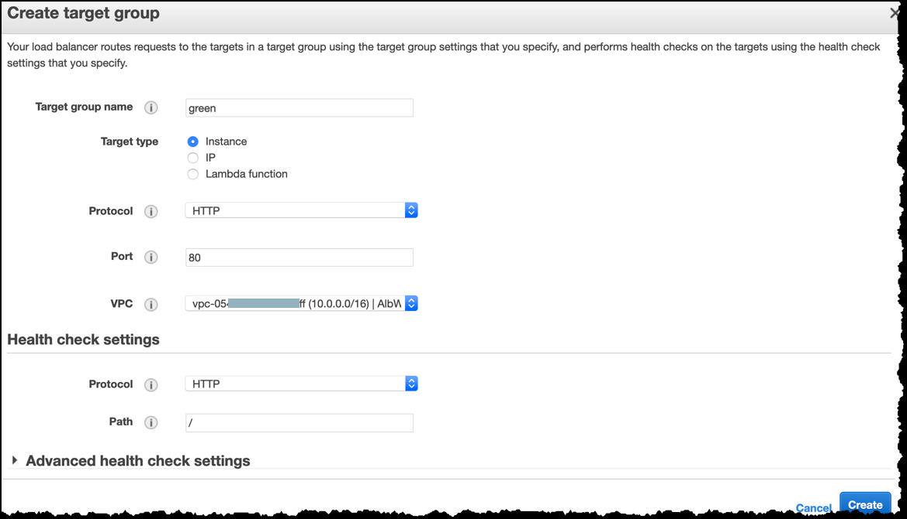

# SQ6B - Loadbalancing mit **AWS Elastic Load Balancer (ELB)** 

**Team:**

* Yanis Sebastian Zürcher - Dokumentation & Grafiken
* Jason Bichsel - Recherche 
* Dominik Könitzer - Recherche

**Datum:** 27.05.2025

**Deadline:** Vor dem Start des nächsten Unterrichtsblocks (28.05.2025)

 

 
 
 
 
 
 

---

## Inhaltsverzeichnis
1. [Bedeutung von Loadbalancing](#1-bedeutung-von-loadbalancing)
2. [Funktionsweise](#2-funktionsweise)
3. [Vorteile eines Load Balancers](#3-vorteile-eines-load-balancers)
4. [Load-Balancing-Algorithmus Least Connection](#4-load-balancing-algorithmus-least-connection)
5. [Beitrag zur Leistung, Skalierbarkeit und Verfügbarkeit](#5-beitrag-zur-leistung-skalierbarkeit-und-verfugbarkeit)
6. [Produktvorstellung AWS Elastic Load Balancing](#6-produktvorstellung-aws-elastic-load-balancing)
7. [Voraussetzungen an die IT-Infrastruktur](#7-voraussetzungen-an-die-it-infrastruktur)
8. [Ab wann lohnt sich Loadbalancing](#8-ab-wann-lohnt-sich-loadbalancing)
9. [Fazit](#fazit)
---

## 1  Bedeutung von Loadbalancing
* **Definition**: Loadbalancer verteilen eingehende Anfragen (TCP-Verbindungen oder HTTP-Requests) auf mehrere Server-Instanzen.  
* **Ziele**  
  * Vermeidung von Single-Point-of-Failure -> Hochverfügbarkeit  
  * Gleichmässige Auslastung -> bessere Performance  
  * Transparente horizontale Skalierung ohne Änderung am Client  
* Ohne Loadbalancer riskieren Unternehmen Ausfälle, lange Antwortzeiten und unzufriedene Nutzende.

---

## 2  Funktionsweise
1. **DNS/Endpoint**: Client löst den DNS Namen des ELB auf (TTL ~= 60 s).  
2. **Listener**: ELB hört auf definierte Ports (zb 443 HTTPS).  
3. **Health Checks**: Unabhängige Prüfungen stellen sicher, dass nur *gesunde* Targets Traffic erhalten.
4. **Routing-Entscheid**  
   * Pro Request/Verbindung wählt der ELB gemäss festgelegtem Algorithmus ein Ziel in einer Target Gruppe.  
5. **Verteilung über AZs**: ELB Instances stehen in mehreren Availability Zones und skalieren automatisch mit.

> **Grafik:**  

---

## 3  Vorteile eines Load Balancers
| Vorteil | Erläuterung |
|---------|-------------|
| **Hochverfügbarkeit** | Failover: Fällt ein Target aus, werden Requests zu gesunden Zielen umgeleitet. |
| **Performance** | Verteilte Last -> kürzere Antwortzeiten, höherer Durchsatz. |
| **Skalierbarkeit** | Neue Instanzen lassen sich ohne Downtime in die Target Gruppe aufnehmen (horizontal). |
| **Sicherheit** | Zentraler TLS-Termination-Punkt, integrierbar mit AWS WAF/Shield. |
| **Betriebs­transparenz** | Access-Logs, Request-Tracing & CloudWatch-Metriken bieten Einblick. |

---

## 4  Load-Balancing-Algorithmus "Least Connection"
### 4.1 Grundprinzip  
Der **Least-Connection (Least Outstanding Requests) Algorithmus** leitet neue Anfragen an das Target mit den _wenigsten_ aktuell offenen Verbindungen/Requests. Damit eignet er sich besonders, wenn:

* Requests unterschiedlich lange laufen (z. B. datenbanklastige Queries).  
* Instanzen ähnliche Hardware haben, sich die Last aber dynamisch verändert.

### 4.2 Implementierung bei AWS ELB
* **Classic LB**: HTTP/HTTPS-Listener nutzen Least Outstanding Requests, TCP-Listener Round Robin.  
* **Application LB**: Routing-Algorithmus ist pro Target-Gruppe umschaltbar; neben Round Robin steht „Least Outstanding Requests“ zur Wahl.

### 4.3 Ablaufdiagramm

---

## 5  Beitrag zur Leistung, Skalierbarkeit & Verfügbarkeit
| Aspekt | Wie ELB hilft |
|--------|---------------|
| **Leistung** | Gleichmässige Verteilung reduziert Queuing; Slow Start verhindert Instanz-Überlast beim Hinzufügen. |
| **Skalierbarkeit** | Auto Scaling kann Instanzen nach Bedarf starten/stoppen; ELB registriert sie automatisch. |
| **Redundanz** | Mehrere AZs -> AZ-Failover; Cross-Zone-LB verteilt Traffic auch bei ungleicher Instanzanzahl. |
| **Verfügbarkeit** | 99.99 % SLA (ALB/NLB); Health Checks + automatisches Skalieren der LB-Nodes.

---

## 6  Produktvorstellung : AWS Elastic Load Balancing
### 6.1 Überblick  
AWS ELB ist ein Fully managed Service, der in drei Varianten angeboten wird:

| Typ | OSI-Schicht | Use Case-Highlights |
|-----|-------------|---------------------|
| **Application LB** | L7 (HTTP/HTTPS) | Routing nach Host/Path/Query, WebSocket, gRPC, OIDC-Auth, WAF-Integration |
| **Network LB** | L4 (TCP/UDP/TLS) | Millionen RPS, statische IP/EIP, TLS-Pass-Through, Einstieg für on-prem VPN |
| **Gateway LB** | L3 | Transparentes Einbinden von Third-Party-Appliances (Firewalls, IDS) |

ELB erledigt alle Skalierungs-, Wartungs- und Patch-Aufgaben automatisch.

### 6.2 Typische Anwendung
* **Web- & API-Frontends**: ALB mit Path-Based-Routing auf Microservices / ECS Tasks / EKS Pods.  
* **IoT / Gaming**: NLB für niedrige Latenz & UDP-Traffic.  
* **Security-Hub**: GLB verteilt Traffic an virtuelle Firewalls.

### 6.3 Funktionsumfang (Auswahl)
* HTTPS Offloading / TLS 1.3  
* HTTP/2 & gRPC  
* Sticky Sessions (Cookie-basiert)  
* Access-Logs & Request-Tracing Header (X-Amzn-Trace-Id)
* Integration: AWS Auto Scaling, CloudWatch Alarms, WAF, Shield, PrivateLink

### 6.4 Target Group anlegen (Beispiel)

Der erste Schritt, um Instanzen am Application Load Balancer zu registrieren,
ist das Erstellen einer **Target Group**.  
Im AWS-Dialog „Create target group“ werden Name, Protokoll, Port, VPC und
Health-Check-Pfad definiert:

*Abbildung X: Konfiguration einer neuen Target Group  
(`Protocol = HTTP`, `Port = 80`, Health-Check Pfad `/`).*

---

## 7  Voraussetzungen an die IT-Infrastruktur
* **AWS-Konto & IAM-Rollen** (Least Privilege, ELB-FullAccess für Terraform/CloudFormation).  
* **Netzwerk-Setup**  
  * VPC mit mindestens **zwei** öffentlichen Subnetzen (je AZ) für den LB.  
  * Security Groups: Ingress -> 443/80 aus dem Internet; Egress -> Targets.  
* **Compute-Ressourcen**  
  * EC2, ECS (Fargate), EKS oder Lambda als Targets.  
* **Domain-Management**  
  * Route 53 Record (Alias) oder externes DNS mit CNAME auf `<elb-dns>.amazonaws.com`.  
* **CLI / IaC-Tooling**  
  * AWS CLI v2, Terraform oder AWS CDK für Automatisierung.  
* **Monitoring**  
  * CloudWatch Logs & Metrics, ggf. Grafana/Prometheus Exporter!!!!.

---

## 8  Ab wann lohnt sich Loadbalancing?
| Indikator | Erläuterung |
|-----------|-------------|
| **> ~70 % CPU-Auslastung** oder **lange Queue Times** auf einer einzelnen Instanz | Verteilte Last senkt Latenz. |
| **SPOF-Risiko**: Nur **eine** Server-Instanz | LB sorgt für Redundanz. |
| **Geplantes Wachstum** (Marketing-Kampagne, Black Friday) | Schnelle horizontale Skalierung ohne Downtime. |
| **Regulatorische oder SLA-Vorgaben** (> 99.9 % Uptime) | ELB erfüllt hohe Verfügbarkeits­anforderungen out of the box. |
| **Multi-AZ-Resilienz** | Pflicht in hochkritischen Produktiv­umgebungen. |

---

## Fazit

Ein Loadbalancer ist ein essenzieller Bestandteil moderner IT-Infrastrukturen, insbesondere bei hochverfügbaren, skalierbaren Web- und Cloud-Anwendungen. Durch die gezielte Verteilung des Datenverkehrs auf mehrere Server erhöht er nicht nur die Leistungsfähigkeit eines Systems, sondern minimiert gleichzeitig das Risiko eines Ausfalls.

Die Analyse des AWS Elastic Load Balancers (ELB) zeigt, wie ein vollständig verwalteter Dienst Unternehmen in die Lage versetzt, auch bei hohem Traffic zuverlässig und sicher zu operieren. Dank flexibler Algorithmen wie „Least Outstanding Requests“ und tiefer Integration in andere AWS-Dienste wie Auto Scaling, CloudWatch und WAF bietet ELB eine robuste, skalierbare Lösung für unterschiedlichste Anwendungsszenarien.

Ab einer gewissen Systemlast oder bei steigenden Anforderungen an Verfügbarkeit, Redundanz und Skalierbarkeit ist der Einsatz eines Loadbalancers nicht nur sinnvoll, sondern notwendig, um den heutigen Qualitätsansprüchen gerecht zu werden.

---

**Ende der Dokumentation.**