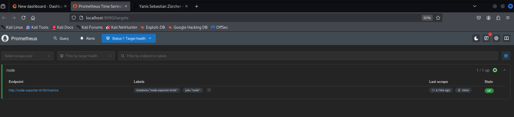
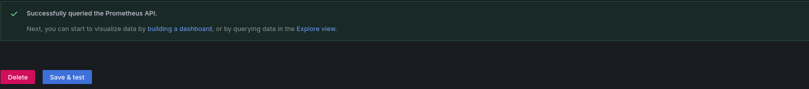
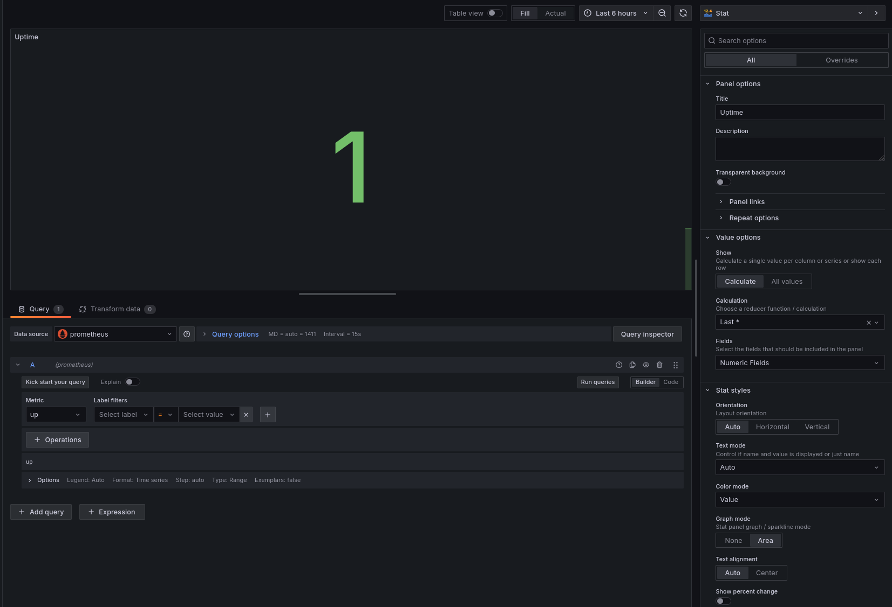
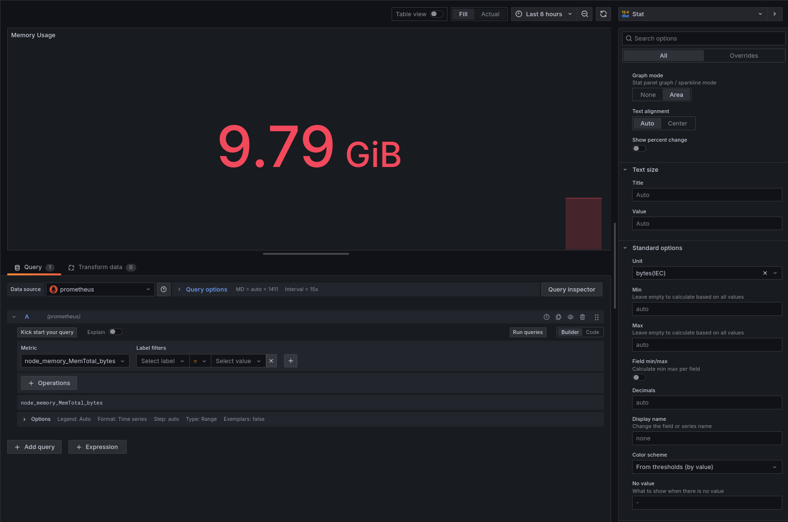
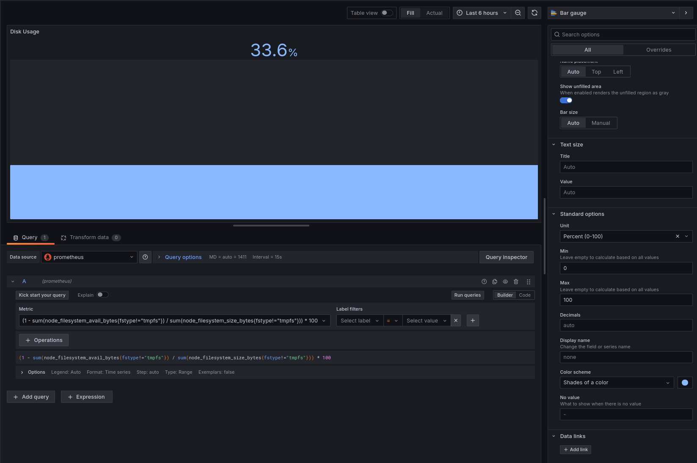
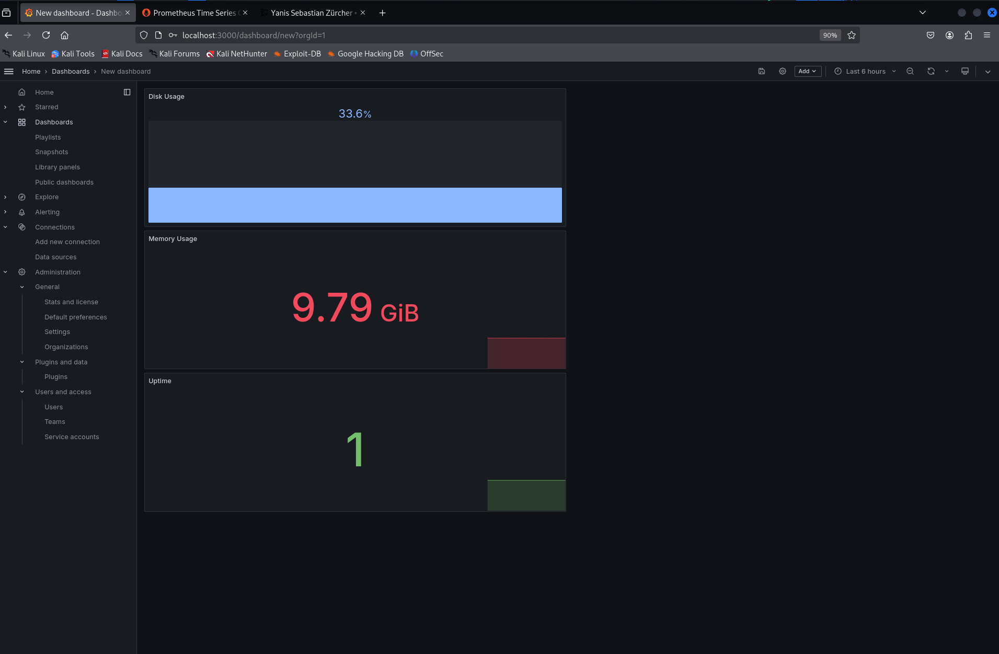
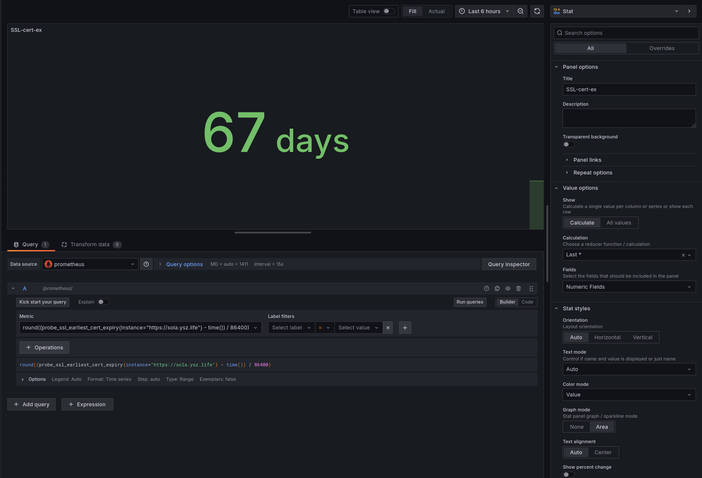

# SideQuest 7A – Monitoring mit Prometheus & Grafana

**Team:**

* Yanis Sebastian Zürcher - Doku & Umsetzung
* Jason Bichsel - Recherche
* Dominik Könitzer - Recherche

**Datum:** 03.06.2025

**Deadline:** Vor dem Start des nächsten Unterrichtsblocks (04.06.2025)

---

## Inhaltsverzeichnis

1. Zielsetzung
2. Architektur & Technologien
3. Projektstruktur
4. Docker-Compose-Stack
5. Schritt 1 - Container Stack Starten
6. Schritt 2 - Prometheus in Grafana verbinden
7. Schritt 3 - Dashboard erstellen
8. Gesamtes Dashboard
9. Extra: Website- & SSL-Monitoring
10. Reflexion

---

## 1. Zielsetzung


Im Rahmen dieses SideQuests wurde ein Monitoring-System aufgesetzt, um die verschiedenen zuvor eingerichteten Server und Dienste zentral zu überwachen. Ziel war es, die Komponenten **Prometheus** und **Grafana** korrekt zu installieren, miteinander zu verbinden und ein Dashboard zu erstellen, das die wichtigsten Systemmetriken visualisiert:

- Uptime-Status der Systeme  
- RAM-Verbrauch (Memory Usage)  
- Festplattenauslastung (Disk Usage)

---

## 2. Architektur & Technologien

| Komponente        | Technologie / Image                       | Zweck                            |
| ----------------- | ----------------------------------------- | -------------------------------- |
| **prometheus**    | `prom/prometheus:latest`                  | Sammeln & Speichern von Metriken |
| **node-exporter** | `quay.io/prometheus/node-exporter:latest` | Exportiert Host-Systemmetriken   |
| **grafana**       | `grafana/grafana-oss:11.0.1`              | Visualisierung & Alarmierung     |


---

## 3. Projektstruktur
 
```txt
~/sq-grafana/
├── docker-compose.yml
└── prometheus.yml 
```

---

## 4. Docker-Compose-Stack

### **docker-compose.yml**: 

>[!NOTE]
> Zur Info, es wäre besser  gewesen die prometheus datasource und grafana dashboard zu mounten damit sie nicht verloren gehen, wenn der container down geht --  ist mir aber erst später aufgefallen, weshalb ichs ohne gemacht habe.

```yaml
version: "3.8"

services:
  prometheus:
    image: prom/prometheus
    container_name: prometheus
    volumes:
      - ./prometheus.yml:/etc/prometheus/prometheus.yml
    ports:
      - "9090:9090"
    restart: unless-stopped

  node-exporter:
    image: quay.io/prometheus/node-exporter:latest
    container_name: node-exporter
    ports:
      - "9100:9100"
    restart: unless-stopped

  grafana:
    image: grafana/grafana-oss:11.0.1
    container_name: grafana
    environment:
      GF_SECURITY_ADMIN_USER: admin
      GF_SECURITY_ADMIN_PASSWORD: admin
    ports:
      - "3000:3000"
    depends_on: [prometheus]
    restart: unless-stopped
```

### **prometheus.yml**: 
```yaml
global:
  scrape_interval: 15s
  evaluation_interval: 15s

scrape_configs:
  - job_name: 'node'
    static_configs:
      - targets: ['localhost:9100']
```

---

## 5. Schritt 1 - Container-Stack Starten

```bash
docker-compose up -d --remove-orphans ## --remove-orphans wegen letzter sq
docker ps # checken ob alle container laufen (up)
```	

**Output**:
```bash
┌──(kali㉿kali)-[~/sq-grafana]
└─$ docker-compose up -d --remove-orphans

Removing orphan container "mqtt-broker"
Removing orphan container "sensor2"
Removing orphan container "sensor1"
Pulling node-exporter (quay.io/prometheus/node-exporter:latest)...
latest: Pulling from prometheus/node-exporter
9fa9226be034: Already exists
1617e25568b2: Already exists
c6e37428e3b3: Pull complete
Digest: sha256:d00a542e409ee618a4edc67da14dd48c5da66726bbd5537ab2af9c1dfc442c8a
Status: Downloaded newer image for quay.io/prometheus/node-exporter:latest
Creating prometheus    ... done
Creating node-exporter ... done
Creating grafana       ... done
```

```bash
┌──(kali㉿kali)-[~/sq-grafana]
└─$ docker ps           
CONTAINER ID   IMAGE                                     COMMAND                  CREATED       STATUS       PORTS                                       NAMES
0f38c263720d   grafana/grafana-oss:11.0.1                "/run.sh"                3 hours ago   Up 3 hours   0.0.0.0:3000->3000/tcp, :::3000->3000/tcp   grafana
b2b3921c62d4   prom/prometheus                           "/bin/prometheus --c…"   3 hours ago   Up 3 hours   0.0.0.0:9090->9090/tcp, :::9090->9090/tcp   prometheus
210b2339c7a1   quay.io/prometheus/node-exporter:latest   "/bin/node_exporter"     3 hours ago   Up 3 hours   0.0.0.0:9100->9100/tcp, :::9100->9100/tcp   node-exporter
```

---

## 6. Schritt 2 - Prometheus & Grafana starten

### Prometheus (localhost:9090)
- Überprüfen der Targets:


### Grafana (localhost:3000)
- Login mit `admin/admin`
- Navigationspfad:
  - Connections -> Data Sources -> Add data source -> Prometheus -> URL: `http://prometheus:9090` -> Save & Test


---

## 7. Schritt 3 - Dashboard erstellen

> Ich habe das Dashboard erstellt und Prometheus als datasource hinzugefügt.

### 7.1 Panel 1: Uptime

| Attribut           | Wert     |
| ------------------ | -------- |
| **Query**          | `up`     |
| **Visualisierung** | Stat     |

> Flow:
> select metric -> run query -> change visualization to stat

**run query.**



### 7.2 Panel 2: Memory Usage

| Attribut           | Wert                                                          |
| ------------------ | ------------------------------------------------------------- |
| **Query**          | `node_memory_MemTotal_bytes - node_memory_MemAvailable_bytes` |
| **Visualisierung** | Stat                                                          |
| **Einheit**        | Gigabytes (GB)                                                |

> Flow:
> select metric -> run query -> change visualization to stat -> unit -> bytes (IEC)

**run query.**



### 7.3 Panel 3: Disk Usage

| Attribut                 | Wert                                                                                                               |
| ------------------------ | ------------------------------------------------------------------------------------------------------------------ |
| **Query** | `(1 - sum(node_filesystem_avail_bytes{fstype!="tmpfs"}) / sum(node_filesystem_size_bytes{fstype!="tmpfs"})) * 100` |
| **Visualisierung**       | Bar Gauge                                                                                                          |
| **Einheit**              | Prozent (0 – 100 %)                                                                                                |

> Flow:
> select metric -> run query -> change visualization to bar gauge -> unit -> Percent (0-100) -> min 0, max 100, color scheme -> shades of color -> some blue variation i could select.

> [!NOTE]
> Meine erste query wäre `(1 - node_filesystem_avail_bytes{fstype!="tmpfs"} / node_filesystem_size_bytes{fstype!="tmpfs"}) * 100` gewesen, 
> jedoch zeigte diese in meinem kontrollierten docker setup duplizierte werte und nur eine disk (`/dev/sda1`) wurde mehrfach exportiert.

**run query.**



---

## 8. Gesamtes Dashboard

Alle drei Panels wurden in einem Dashboard zusammengeführt und zeigen Live-Daten in Echtzeit:



---

## 9. Extra: Website- & SSL-Monitoring

Zusätzlich habe ich ein Panel integriert, das mithilfe des **Blackbox Exporters** das Ablaufdatum des SSL-Zertifikats meiner Website [`sola.ysz.life`](https://sola.ysz.life) in Tagen anzeigt.

Dazu wurde folgende PromQL-Query verwendet:

```promql
round((probe_ssl_earliest_cert_expiry{instance="https://sola.ysz.life"} - time()) / 86400)
```

> unit: custom -> days



---

## 10. Reflexion

 - Technik: Reibungslose Installation via Docker; Node-Exporter liefert sofort Basis-Metriken.
 - Problembehebung: 
    - Panel 1: Problem mit `up = 0` behoben durch Umstellung Node-Exporter auf Port-Mapping & Anpassung der Targets (in docker-compose.yml und prometheus.yml), dann docker-compose down, docker-compose up -d.
    - Panel 3: Mehrfach gemeldete Partitionen durch `sum()` konsolidiert.
 - Lerngewinn: 
    - Prometheus-Targets korrekt definieren.
    - Verständnis von Query-Optimierung
    - Grafana-Panels gezielt gestalten und anpassen (Einheiten, Visualisierung, Farbschemata).
    - Blackbox Exporter integrieren und PromQL-Query anpassen.

Beim nächsten Mal würde ich die Prometheus-Datenquelle sowie das Dashboard persistent speichern (z. B. via Volumes), um Datenverlust beim Neustarten der Container zu vermeiden.

--- 

**Ende der Dokumentation**