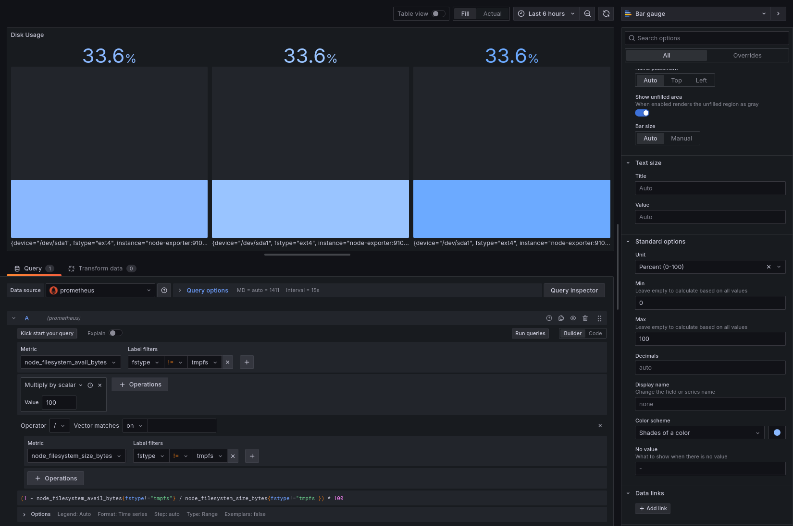

# SideQuest: 7A

**Team:**

* Yanis Sebastian Zürcher - Doku & Umsetzung
* Jason Bichsel - Recherche
* Dominik Könitzer - Recherche

**Datum:** 03.06.2025

**Deadline:** Vor dem Start des nächsten Unterrichtsblocks (04.06.2025)

---

## Inhaltsverzeichnis

---

start: 
structure: 
```txt
~/sq-grafana/
├── docker-compose.yml
├── prometheus.yml
├── mosquitto.conf
└── doc.md  
```

docker-compose.yml: 
```yaml
version: "3.8"

services:
  prometheus:
    image: prom/prometheus
    container_name: prometheus
    volumes:
      - ./prometheus.yml:/etc/prometheus/prometheus.yml
    ports:
      - "9090:9090"
    restart: unless-stopped

  node-exporter:
    image: quay.io/prometheus/node-exporter:latest
    container_name: node-exporter
    network_mode: host
    pid: host
    restart: unless-stopped

  grafana:
    image: grafana/grafana-oss:11.0.1
    container_name: grafana
    environment:
      GF_SECURITY_ADMIN_USER: admin
      GF_SECURITY_ADMIN_PASSWORD: admin
    ports:
      - "3000:3000"
    depends_on:
      - prometheus
    restart: unless-stopped
```

prometheus.yml: 
```yaml
global:
  scrape_interval: 15s
  evaluation_interval: 15s

scrape_configs:
  - job_name: 'node'
    static_configs:
      - targets: ['localhost:9100']
```

cmd: `docker-compose up -d --remove-orphans`

process: 

both files, prometheus & docker compose, 
then remove /sensor/ and its contents, 
then ran it with docker-compose up -d --remove-orphans, remove orphans cause of the previous sq, 
then docker ps to check if running, 
then access prometheus at localhost:9090 and grafana at localhost:3000, 
then in grafana added prometheus (http://localhost:9090 -> save & test) as data source, screenshot: 

then created new dashboard in grafana, goal; Uptime, Memory Usage, Disk Usage. 
how: 
 - create new dashboard
 - create visualisation
 - select prometheus as data source
 - 1 Panel: Uptime: 
    - select query: metric: up -> run query -> change visualization to stat, shows 0. fix: 
        change docker-compose.yml: 
        and replace `node-exporter` to: 
        ```yaml
        node-exporter:
            image: quay.io/prometheus/node-exporter:latest
            container_name: node-exporter
            ports:
            - "9100:9100"
            restart: unless-stopped
        ```
        change prometheus.yml to (localhost:9100 -> node-exporter:9100): 
        ```yaml
        global:
        scrape_interval: 15s
        evaluation_interval: 15s

        scrape_configs:
        - job_name: 'node'
            static_configs:
            - targets: ['node-exporter:9100']
        ```
        then docker-compose down, docker-compose up -d.
        fixed. 
        re-create the dashboard in grafana and re run the up query, now shows 1: 
        done: 
        
 - 2 Panel: Memory Usage 
    - write query: 
        - metric: node_memory_MemTotal_bytes - node_memory_MemAvailable_bytes
    change visualization to stat, 
    run both queries, 
    then, unit -> bytes (IEC)
    done: 
    
 - 3 Panel: Disk Usage 
    my first query woudlve been `(1 - node_filesystem_avail_bytes{fstype!="tmpfs"} / node_filesystem_size_bytes{fstype!="tmpfs"}) * 100`, 
    however since im using controlled  a docker setup they're showing duplicate values and only one disk (/dev/sda1) is exported multiple ways.
    for reference:
     

    therefore, i used this query: 
    - write query: 
        - metric: (1 - sum(node_filesystem_avail_bytes{fstype!="tmpfs"}) / sum(node_filesystem_size_bytes{fstype!="tmpfs"})) * 100
    change visualization to bar gauge, 
    then, unit -> Percent (0-100) -> min 0, max 100, 
    color scheme -> shades of color -> some blue variation i could select.
    done: 
    


 


**Ende der Dokumentation**