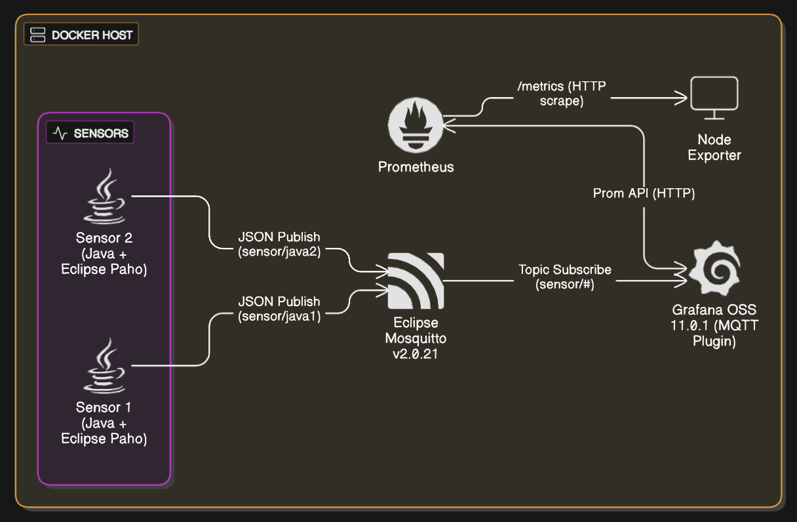
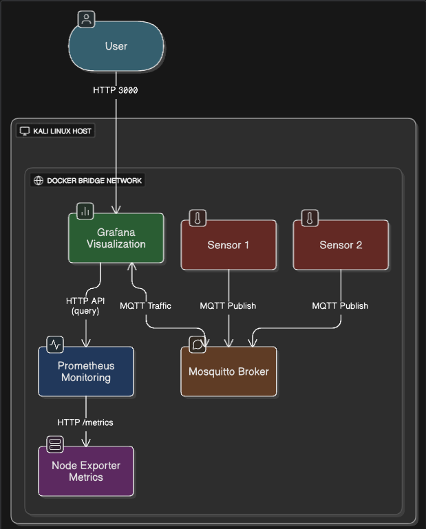
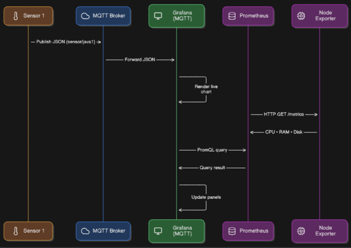

# Dokumentation: Verteilte Systeme im Modul M321

**Team:**

- Yanis Sebastian Zürcher – Dokumentation
- Jason Bichsel – Recherche
- Dominik Könitzer – Recherche

**Datum:** 04.06.2025

**Deadline:** Vor dem Start des nächsten Unterrichtsblocks (04.06.2025 08:30)

---

## Inhaltsverzeichnis

1. Einleitung
2. Systeme und Dienste
3. Beschreibung der System-Interaktionen
   - 3.1 Komponenten-Diagramm [Beschreibung]
   - 3.2 Deployment-Diagramm [Beschreibung]
   - 3.3 Ablaufdiagramm (E2E) [Beschreibung]
4. Beispielhafter Ablauf (End-2-End)
5. Fazit und Erkenntnisse

---

## 1. Einleitung

Im Verlauf des Moduls M321 haben wir diverse verteilte Systeme geplant, entwickelt und schrittweise aufgebaut. Der Fokus lag auf der praktischen Anwendung von Docker, Netzwerkdiensten (wie MQTT), Monitoring-Systemen (Prometheus, Grafana), sowie der Konfiguration und Integration von mehreren Containern zu einem funktionalen Gesamtsystem. Ziel dieser Dokumentation ist es, alle eingesetzten Komponenten und deren Interaktion zu dokumentieren, einen vollständigen Ablauf zu beschreiben und die Systemarchitektur nachvollziehbar zu machen.

---

## 2. Systeme und Dienste

| Komponente        | Technologie / Version             | Zweck                                              |
| ----------------- | --------------------------------- | -------------------------------------------------- |
| MQTT-Broker       | Eclipse Mosquitto v2.0.21         | Empfang & Verteilung von Sensor-Daten (MQTT)       |
| Sensoren (Java)   | Java + Eclipse Paho MQTT v1.2.5   | Publizieren periodischer JSON-Werte via MQTT       |
| Prometheus        | prom/prometheus:latest            | Sammlung und Speicherung von Metriken              |
| Node Exporter     | quay.io/prometheus/node-exporter  | Export von Systemmetriken des Hosts                |
| Grafana OSS       | grafana/grafana-oss:11.0.1        | Visualisierung der gesammelten Metriken            |
| Docker Compose    | v3.8 Format                       | Orchestrierung der Container-Dienste               |
| Blackbox Exporter | prom/blackbox-exporter (optional) | SSL-Zertifikat-Check (nicht zentraler Bestandteil) |
| AWS ELB (theor.)  | Elastic Load Balancer (AWS)       | Theoretische Analyse zur Lastverteilung            |

---

## 3. Beschreibung der System-Interaktionen

### 3.1 Komponenten-Diagramm

### 3.2 Deployment-Diagramm

### 3.3 Ablaufdiagramm (E2E)

---

## 4. Beispielhafter Ablauf (End-2-End)

Ein typischer Ablauf im laufenden System:

1. Beim Starten des Stacks (`docker compose up -d --build`) werden alle Container automatisch gestartet:
   * `sensor1`, `sensor2` publizieren periodisch Messdaten.
   * `mqtt-broker` empfängt und verteilt die Nachrichten.
   * `grafana` ist über das MQTT-Plugin mit dem Broker verbunden.
   * `prometheus` sammelt parallel Systemdaten.
2. Der Benutzer öffnet das Grafana-Dashboard auf `localhost:3000`.
3. Unter dem Panel „Sensor1“ wird der Temperaturverlauf in Echtzeit angezeigt.
4. Panel „Memory Usage“ zeigt freien vs. belegten RAM.
5. Panel „Disk Usage“ zeigt die prozentuale Auslastung der Hauptpartition.
6. Optional: Das Panel für SSL-Monitoring zeigt das Ablaufdatum eines SSL-Zertifikats einer externen Website (zb. `sola.ysz.life`).

---

## 5. Fazit und Erkenntnisse

Die Arbeit mit verteilten Systemen im Modul M321 hat gezeigt, wie wichtig eine saubere Trennung von Diensten und deren gezielte Orchestrierung ist. Besonders wertvoll war die praktische Erfahrung mit:

* Containerisierung über Docker
* Orchestrierung via Docker Compose
* Nutzung von Prometheus & Grafana im Kontext von Systemüberwachung
* Verarbeitung und Visualisierung von MQTT-Datenströmen
* Modularisierung durch Wiederverwendung bestehender Java-Komponenten

Ein wichtiges Learning war der Unterschied zwischen Shell- vs. JSON-basiertem `ENTRYPOINT` bei der ENV-Expansion, sowie die Stabilisierung von Systemen über `depends_on`, Port-Mapping und Logging via `docker logs`.

Für künftige Projekte empfiehlt sich zusätzlich, Volumes für Konfigurationen und Dashboards zu mounten, um Datenpersistenz zu garantieren.

---

**Ende der Dokumentation**
